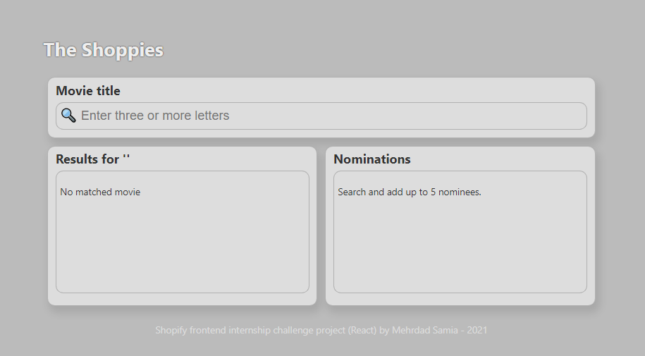

# Shoppies Movies
### Shopify frontend internship 2021 challenge project

  

 
  

## Features
- Search OMDB's API.
- Live search by typing in search box
- Show search result with title, year of release and nomination button.
- Updates to the search terms updates the result list.
- Movies in search results can be added and removed from the nomination list.
- If a search result has already been nominated, it will not be showed in results.
- Display a banner when the user has 5 nominations.
- Nominees will be saved and protected if user close or refresh the page.

Link to the live version of **[Shoppies Movies](https://shoppiesmovies.herokuapp.com/)** hosted by Heroku.

## Technical aspects
- Using React 17.0.2.
- No external React components.
- Pure CSS, no external frameworks.
- Unicode character icons.
- Mobile friendly ( Not optimized for all devices )

